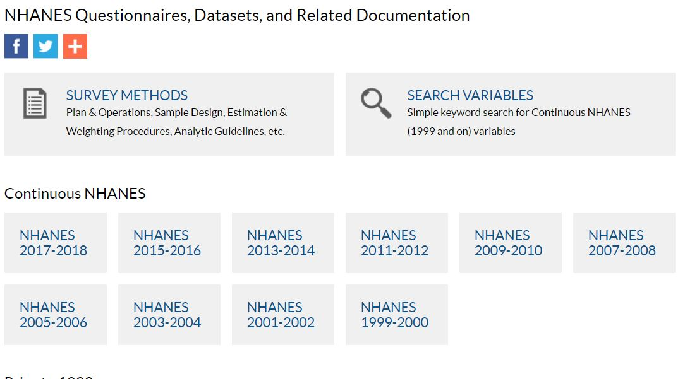
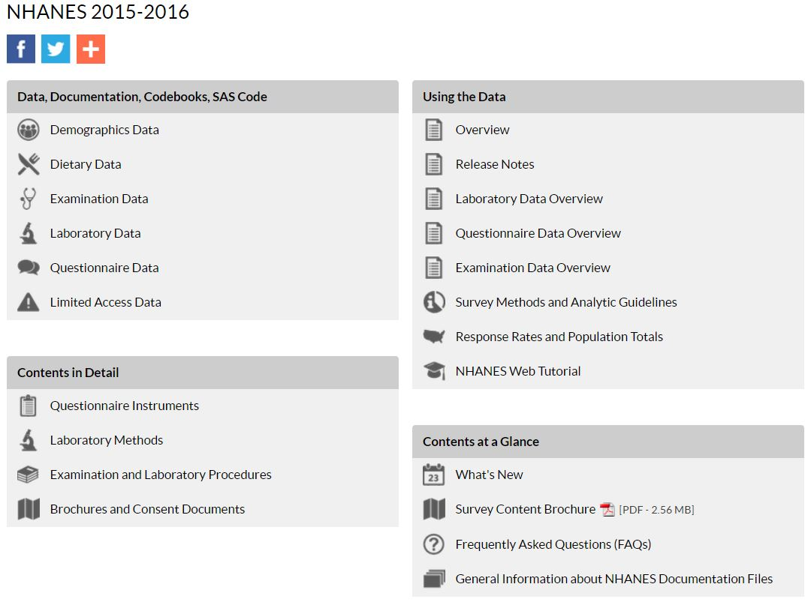
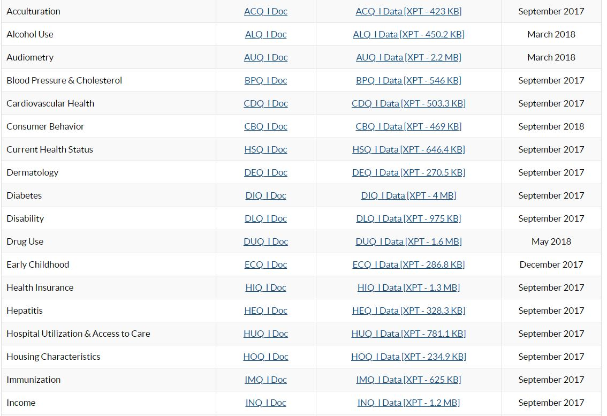

```{r setup, include=FALSE}
options(htmltools.dir.version = FALSE)
devtools::install_github("haozhu233/kableExtra")
library(tidyverse)
library(rio)
library(here)
library(kableExtra)
theme_set(theme_minimal())
```

```{r data, echo = FALSE}

# Loading CSV files
duq_i <- import(here("data", "duq_i.csv"), 
                setclass = "tbl_df")
demo_i <- import(here("data", "demo_i.csv"),
                setclass = "tbl_df")
dpq_i <- import(here("data", "dpq_i.csv"),
                setclass = "tbl_df")
huq_i <- import(here("data", "huq_i.csv"),
                setclass = "tbl_df")
hiq_i <- import(here("data", "hiq_i.csv"),
                setclass = "tbl_df")
#merge files
d <- merge(duq_i,demo_i, by = "V1")
d1 <- merge(dpq_i, huq_i, by = "V1")
d2 <- merge(d, d1, by = "V1") 
fd <- merge(d2, hiq_i, by = "V1")

#select columns
td0 <- fd %>% 
  select(V1,DPQ010, DPQ020, DPQ030, DPQ040, DPQ050, DPQ060, DPQ070, DPQ080, DPQ090, DPQ100, RIDRETH3, RIAGENDR, DMDEDUC2, INDHHIN2, RIDAGEYR, DUQ260, DUQ300, DUQ340, DUQ430, DUQ210, HIQ011, HUQ090) 
#computing depression total score
td0 <- td0 %>%
  mutate(sum_depression = DPQ010 + DPQ020 + DPQ030 + DPQ040 + DPQ050 + DPQ060 + DPQ070 + DPQ080 + DPQ090)
#replace value with NA
#install.packages("naniar")
 td <- td0 %>% 
   naniar::replace_with_na(replace = list(DUQ340 = 999)) %>% 
   mutate(age_stim = (DUQ260 + DUQ340) / 2) 
# Labels for categorical variables
td <- td %>% 
  mutate(ethnicity = case_when(RIDRETH3 == 1 ~ "Mexican American", 
                               RIDRETH3 == 2 ~ "Other Hispanic", 
                               RIDRETH3 == 3 ~ "Non-Hispanic White",
                               RIDRETH3 == 4 ~ "Non-Hispanic Black",
                               RIDRETH3 == 6 ~ "Non-Hispanic Asian",
                               RIDRETH3 == 7 ~ "Other Race - Including Multi-Racial",
                               TRUE ~ NA_character_)) 
td <- td %>% 
  mutate(sex = case_when(RIAGENDR == 1 ~ "Male", 
                         RIAGENDR == 2 ~ "Female", 
                         TRUE ~ NA_character_)) 
td <- td %>% 
  mutate(education = case_when(DMDEDUC2 == 1 ~ "Less than 9th grade",
                               DMDEDUC2 == 2 ~ "9-12th grade (no diploma)",
                               DMDEDUC2 == 3 ~ "High school graduate/GED or equivalent",
                               DMDEDUC2 == 4 ~ "Some college of AA degree",
                               DMDEDUC2 == 5 ~ "College graduate of above", 
                               DMDEDUC2 == 7 ~ "Refused",
                               DMDEDUC2 == 9 ~ "Don't know",
                               TRUE ~ NA_character_))
td <- td %>% 
  mutate(income = case_when(INDHHIN2 == 1 ~ "$0 - $4,999",
                            INDHHIN2 == 2 ~ "$5,000 to $9,999",
                            INDHHIN2 == 3 ~ "10,000 to $14,999",
                            INDHHIN2 == 4 ~ "$15,000 to $19,999",
                            INDHHIN2 == 5 ~ "$20,000 to $24,999",
                            INDHHIN2 == 6 ~ "$25,000 to $34,999",
                            INDHHIN2 == 7 ~ "$35,000 to $44,999",
                            INDHHIN2 == 8 ~ "$45,000 to $54,999",
                            INDHHIN2 == 9 ~ "$55,000 to $64,999",
                            INDHHIN2 == 10 ~ "$65,000 to $74,999",
                            INDHHIN2 == 12 ~ NA_character_,
                            INDHHIN2 == 13 ~ NA_character_,
                            INDHHIN2 == 14 ~ "$75,000 to $99,999",
                            INDHHIN2 == 15 ~ "$100,000 and over",
                            INDHHIN2 == 77 ~ "Refused",
                            INDHHIN2 == 99 ~ "Don't know",
                            TRUE ~ NA_character_))
#RIDAGEYR is half categorical (0-79 are values and 80 is 80 and older)
td <- td %>% 
  mutate(insurance = case_when(HIQ011 == 1 ~ "Yes",
                               HIQ011 == 2 ~ "No",
                               HIQ011 == 7 ~ "Refused",
                               HIQ011 == 9 ~ "Don't know",
                               TRUE ~ NA_character_))
td <- td %>% 
  mutate(mental_health = case_when(HUQ090 == 1 ~ "Yes",
                                   HUQ090 == 2 ~ "No",
                                   HUQ090 == 7 ~ "Refused",
                                   HUQ090 == 9 ~ "Don't know",
                                   TRUE ~ NA_character_))
td <- td %>% 
  mutate(rehab = case_when(DUQ430 == 1 ~ "Yes",
                           DUQ430 == 2 ~ "No",
                           DUQ430 == 7 ~ "Refused",
                           DUQ430 == 9 ~ "Don't know",
                           TRUE ~ NA_character_))
#select and rename
td1 <- td %>% 
  select(-2:-15, -HIQ011, -HUQ090, -DUQ430, income) %>% 
  rename(age_marijuana = DUQ210, 
         age_cocaine = DUQ260, 
         age_heroin = DUQ300, 
         age_meth = DUQ340)
#reorder
td1 <- td1 %>% 
  select(1:6, age_stim, sum_depression, rehab, mental_health, insurance, income, 7:10) %>%
  rename(age = RIDAGEYR,
         id = V1)
```

#R ScaRy JouRney


We were interested in using a publicly-available dataset that could translate our skills as researchers and data scientists. 

The dataset that came to mind was the Center for Disease Control and Prevention's (CDC) National Health and Nutrition Examination Survey (NHANES) dataset.

We decided on the 2015-2016 years because it was the most recent data collected.

---
#Why did we use this data?
--

1. it is a widely used dataset for researchers in several fields
--

2. has a wide variety of biofeedback, self-report, and other measures of health constructs
--

3. It has a large sample to draw from
--

4. taught us how to navigate bigger datasets
--

5. but the real reason is because I apparently like to make things harder than they have to be. 

---


[nhanes datasets by different years](https://wwwn.cdc.gov/nchs/nhanes/Default.aspx)
---

---
#Variables used

For our project we decided on several variables including:

1. depressive symptoms
2. insurance (yes/no)
3. race/ethnicity
4. sex
5. education
6. income
7. seeking mental health services (yes/no)
8. if individuals have been to rehab (yes/no)
9. age
10. age which began using substances (marijuana, cocaine, heroin, meth)

---
# So how did we do this

Just a little 

But seriously...
If you try to download NHANES data right now, you get SAS files in `.xpt` files. 

This makes you have to download a file reader from their website. It's really just a huge mess.

---
# Our plan
So after some thinking 

 

We found the `nhanesA` [package](https://cran.r-project.org/web/packages/nhanesA/nhanesA.pdf).

---
This lets you download files straight to *R* without having to use `rio` or `here`.

It was a great resource and the most basic function was to create an object and type in the dataframe to view data straight from the nhanes website.

```{r, echo = TRUE, eval = FALSE}
#huq_i <- nhanes('HUQ_I')
```

Or so we thought.
---
class: inverse, center, middle

# Victories and Challenges
---
# Maria's Victories and Challenges No.1

Challenge: Downloading and merging multiple dataframes from NHANES

```{r example}
#library(nhanesA)

#Mental health services measure
#huq_i <- nhanes('HUQ_I')

#Health insurance measure
#hiq_i <- nhanes('HIQ_I')

```
--

*Victory: We merged these files after first converting to CSV files* 


```{r merge}
#write.csv(duq_i, "duq_i.csv")

#import csv files
#duq_i <- import(here("data", "duq_i.csv"), 
#                 setclass = "tbl_df")
#demo_i <- import(here("data", "demo_i.csv"),
#                 setclass = "tbl_df")
#merge
#d <- merge(duq_i,demo_i, by = "V1")
```
---
# Maria's Victories and Challenges No.2

Challenge: Using our new and unrefined Github skills to work collaboratively on this final project 

--

*Victory: We were creative in our initial problem-solving* 

--
1. We met on campus in a room with a projector 

--
2. We took turns pulling and pushing the main project file from Github   

--
3. We problem-solved code on one person's screen as a team   

---

# Shaina's Victories and Challenges No.1
Challenge: Age of methamphetamine first use is 999 years for one participant.
```{r nairn}
td0 %>% 
  arrange(desc(DUQ340)) %>% 
  select(V1, DUQ340) %>% 
  head(n = 3)
```
--

*Victory: Figuring out how to replace a single value in a column to a missing value.*
```{r replace_with_na, eval = FALSE}
#install.packages("naniar")
 td <- td0 %>% 
   naniar::replace_with_na(replace = list(DUQ340 = 999)) %>% 
   mutate(age_stim = (DUQ260 + DUQ340) / 2) 
```
---
# Shaina's Victories and Challenges No.2

Challenge: No labels for categorical variables

```{r no_labels}
td0 %>% 
  select(RIAGENDR, RIDRETH3) %>% 
  head()
```
---

** Victory: Mutating variables to create labels by referencing the [online codebook](https://wwwn.cdc.gov/Nchs/Nhanes/2015-2016/demo_I.htm). **

```{r labels, eval = FALSE}
td <- td %>% 
  mutate(sex = case_when(RIAGENDR == 1 ~ "Male", 
                         RIAGENDR == 2 ~ "Female", 
                         TRUE ~ NA_character_))
td <- td %>% 
  mutate(income = case_when(INDHHIN2 == 1 ~ "$0 - $4,999",
                            INDHHIN2 == 2 ~ "$5,000 to $9,999",
                            INDHHIN2 == 3 ~ "10,000 to $14,999",
                            INDHHIN2 == 4 ~ "$15,000 to $19,999",
                            INDHHIN2 == 5 ~ "$20,000 to $24,999",
                            INDHHIN2 == 6 ~ "$25,000 to $34,999",
                            INDHHIN2 == 7 ~ "$35,000 to $44,999",
                            INDHHIN2 == 8 ~ "$45,000 to $54,999",
                            INDHHIN2 == 9 ~ "$55,000 to $64,999",
                            INDHHIN2 == 10 ~ "$65,000 to $74,999",
                            INDHHIN2 == 12 ~ NA_character_,
                            INDHHIN2 == 13 ~ NA_character_,
                            INDHHIN2 == 14 ~ "$75,000 to $99,999",
                            INDHHIN2 == 15 ~ "$100,000 and over",
                            INDHHIN2 == 77 ~ "Refused",
                            INDHHIN2 == 99 ~ "Don't know",
                            TRUE ~ NA_character_))
```

---
# Shaina's Victories and Challenges No.3

Challenge: Thinking the data were tidy, but not being able to produce a plot by drug types
```{r td, echo = FALSE}
td1 %>% 
  select(1:5, 9:11) %>% 
  arrange(desc(age_heroin)) %>% 
  head(n = 4)
```
--
*Victory: Creating a tidy dataset that could plot variables by different drug types*
```{r plot_code, eval = FALSE}
td1 %>% 
  select(1, 3:6) %>% 
  gather(drug, age_use, 2:5) %>% 
  separate(drug, c("dis", "drug"), sep = "_") %>% 
  select(-dis) %>% 
  na.omit()
```
--
*Graph will be presented in following slides*

---

# Alejandra's Victories and Challenges No.1

Challenge: Not remembering the order of actions to pull/push commits on GitHub. 

Victory: I wrote them down and I have almost memorized them!

--
1. Pull to make sure you are working on the latest version of the project.

--
2. Work on your project.

--
3. Save your work.

--
4. Stage what you are pushing.

--
5. Write a brief message so everyone knows about your updates.

--
6. Commit.

--
6. Push.

--
7. Pray that no merging conflicts occur. 

---

# Alejandra's Victories and Challenges No.2

Challenge: Accidentaly deleting code from the script the night before our presentation!

Victory: With the power of GitHub and DA combined, I was able to recover the latest version of the script!

--

Victory 2: Now I know that I don't need to panic. 

---
# Alejandra's Victories and Challenges No.3

Challenge: Cluttered plots with levels we were not interested in.

```{r plot_clutt1, message = FALSE, warning = FALSE, eval = FALSE}
td1 %>%
  filter(mental_health != "Don't know") %>% 
  mutate(ethnicity = fct_infreq(ethnicity),
         mental_health = fct_infreq(mental_health)) %>%
  group_by(ethnicity, mental_health) %>%
  ggplot(aes(x = ethnicity, y = sum_depression)) +
  geom_col(aes(fill = mental_health),
           position = "dodge") + 
  labs(title = "Total Depression Score by Ethnicity and Usage of Mental Health Services",
       subtitle = "Faceted by Insurance Coverage",
         caption = "Source: NHANES",
         x = "Ethnicity",
         y = "Total Depression Score",
       fill = "Usage of Mental Health Services") +
  facet_wrap(~insurance) +
  theme(axis.text.x = element_text(angle = 90, hjust = 1))
```

---

```{r plot_clutt2, message = FALSE, warning = FALSE, echo = FALSE}
td1 %>%
  filter(mental_health != "Don't know") %>% #<<
  mutate(ethnicity = fct_infreq(ethnicity),
         mental_health = fct_infreq(mental_health)) %>%
  group_by(ethnicity, mental_health) %>%
  ggplot(aes(x = ethnicity, y = sum_depression)) +
  geom_col(aes(fill = mental_health),
           position = "dodge") + 
  labs(title = "Total Depression Score by Ethnicity and Usage of Mental Health Services",
       subtitle = "Faceted by Insurance Coverage",
         caption = "Source: NHANES",
         x = "Ethnicity",
         y = "Total Depression Score",
       fill = "Usage of Mental Health Services") +
  facet_wrap(~insurance) +
  theme(axis.text.x = element_text(angle = 90, hjust = 1))

```


---

*Victory: Finding useful tips in peers code and suggestions and being able to unclutter the visualizations.*

```{r plot_unclutt1, message = FALSE, warning = FALSE, eval = FALSE}
td1 %>%
  filter(mental_health != "Don't know") %>% 
  filter(insurance == "Yes" | insurance == "No") %>% #<<
  mutate(ethnicity = fct_infreq(ethnicity),
         mental_health = fct_infreq(mental_health)) %>%
  group_by(ethnicity, mental_health) %>%
  ggplot(aes(x = ethnicity, y = sum_depression)) +
  geom_col(aes(fill = mental_health),
           position = "dodge") +
   labs(title = "Total Depression Score by Ethnicity and Usage of Mental Health Services",
       subtitle = "Faceted by Insurance Coverage",
         caption = "Source: NHANES",
         x = "Ethnicity",
         y = "Total Depression Score",
       fill = "Usage of Mental Health Services") +
  facet_wrap(~insurance) +
  theme(axis.text.x = element_text(angle = 90, hjust = 1))
```

--

*Those pesky Boolean operators always get me!* 

---

```{r plot_unclutt2, message = FALSE, warning = FALSE, echo = FALSE}
td1 %>%
  filter(mental_health != "Don't know") %>% 
  filter(insurance == "Yes" | insurance == "No") %>% 
  mutate(ethnicity = fct_infreq(ethnicity),
         mental_health = fct_infreq(mental_health)) %>%
  group_by(ethnicity, mental_health) %>%
  ggplot(aes(x = ethnicity, y = sum_depression)) +
  geom_col(aes(fill = mental_health),
           position = "dodge") +
   labs(title = "Total Depression Score by Ethnicity and Usage of Mental Health Services",
       subtitle = "Faceted by Insurance Coverage",
         caption = "Source: NHANES",
         x = "Ethnicity",
         y = "Total Depression Score",
       fill = "Usage of Mental Health Services") +
  facet_wrap(~insurance) +
  theme(axis.text.x = element_text(angle = 90, hjust = 1))
```


---
# Alejandra's Victories and Challenges No.4

Challenge: Not liking the default theme of the slides using the `xaringan` package. 

Victory: Succesfully changing the theme by adding just a line of code and learning other nifty tricks to make the slides cooler. 

```{r}
#output:
  #xaringan::moon_reader:
    #css: [default, rladies, rladies-fonts]
```


---

# Alejandra's Victories and Challenges No.5

Challenge: Not knowing how to visualize more than one categorical variable at a time.

Victory: Figuring out how to do it by combining fill and facet_wrap. 


```{r using fill & facer_wrap1, message = FALSE, warning = FALSE, eval = FALSE}

td1 %>% 
  mutate(ethnicity = fct_infreq(ethnicity)) %>%
  group_by(ethnicity) %>%
  ggplot(aes(x = ethnicity, y = sum_depression)) +
  geom_col(fill = "cornflowerblue") +
  theme(axis.text.x = element_text(angle = 45, hjust = 1)) +
  facet_wrap(~ sex)

```

```{r using fill & facer_wrap2, message = FALSE, warning = FALSE, echo = FALSE}

td1 %>% 
  mutate(ethnicity = fct_infreq(ethnicity)) %>%
  group_by(ethnicity) %>%
  ggplot(aes(x = ethnicity, y = sum_depression)) +
  geom_col(fill = "cornflowerblue") +
  theme(axis.text.x = element_text(angle = 45, hjust = 1)) +
  facet_wrap(~ sex)

```
---
#JP's Victories and Challenges No.1

Challenge: Recommending this package

Victory: We all learned a lot of valuable skills from working with this package and these data frames. 


---
#JP's Victories and Challenges No.2

Challenge: including pictures and gifs in slides

Victory: a lot of googling and different methods but decided on saving the image followed by some code.

```{r images, echo = FALSE, eval = FALSE}
# 
# 
```

---

#Ongoing Challenges

- Using the `Papaja` package to do the write-up of the project
- Thinking in data frames
- Too afraid to just "Google it!"
- Using gather and spread
- Tidying data to successfully use count function with full dataset
- Trying to make one comprehensive demographics table 

---

class: inverse, center, middle

# Substantive Findings & Interpretations

---
#Shaina Findings

```{r ST_plot, echo = FALSE, fig.height = 4, dev = 'svg'}
td1 %>% 
  select(1, age_cocaine, age_meth, age_heroin, rehab) %>% 
  gather(drug, age_use, 2:4) %>% 
  separate(drug, c("dis", "drug"), sep = "_") %>% 
  select(-dis) %>% 
  na.omit() %>% 
  ggplot(aes(x = age_use)) +
  geom_histogram(aes(fill = rehab), alpha = .8, binwidth = 2) +
  facet_wrap (~ drug) +
  labs(title = "Age of First Use by Drug Type", 
       subtitle = "Colored to show differences between those who've recieved rehab and not",
       caption = "Source: NHANES",
       x = "Age at first use ",
       y = "Frequency") 
```
- Substantially more participants reported cocaine use without receiveing rehab services.
- The majority started using drugs around 15-25, regardless of drug type.

---
#Shaina Findings

```{r ST_plot1, echo = FALSE, fig.height = 4, dev = 'svg'}
td1 %>% 
  select(1, 3:6, sum_depression) %>% 
  gather(drug, age_use, 2:4) %>% 
  separate(drug, c("dis", "drug"), sep = "_") %>% 
  select(-dis) %>% 
  na.omit() %>% 
  ggplot(aes(x = age_use, y = sum_depression, color = drug)) +
  geom_point(size = .75) +
  geom_smooth(method = "lm", se = FALSE, size = 1) +
  labs(title = "Association between Age at First Use and Depression", 
       subtitle = "Colored to show differences among drug types",
       caption = "Source: NHANES",
       x = "Age at first use ",
       y = "Total depression score") 

```

- Those who start using stimulants earlier are more likely to have lower depression scores, compared to those who start using later.
- The opposite was observed for heroin use.

---
#Maria Findings 

```{r  warning = FALSE, echo = FALSE, fig.height=5, dev='svg'}
#onset of druge use by ethnicty and mental health coverage
td_plot <- td1 %>%
    select(age_stim, age_heroin, ethnicity, mental_health) 

td_plot %>%
     drop_na(mental_health) %>%
     ggplot(aes(ethnicity, age_stim)) + 
     geom_boxplot(aes(fill = mental_health)) +
     theme(axis.text.x = element_text(angle = 45, hjust = 1)) +
     scale_y_continuous(name="Age at First Use of Stimulants", limits=c(10, 45)) +
     labs(title = "Age of First Use of Stimulants by Ethnicity", 
          subtitle = "Colored to show differences between those who have and have not accessed mental health insurance",
          caption = "Source: NHANES",
          x = "Ethnicity")

```
---
#Maria Findings
```{r  echo = FALSE, fig.height = 5, dev = 'svg', warning = FALSE, message = FALSE}
#onset of opiod by ethnicty and mental health coverage,
td_plot %>%
     drop_na(mental_health) %>%
     ggplot(aes(ethnicity, age_heroin)) + 
     geom_boxplot(aes(fill = mental_health)) +
     theme(axis.text.x = element_text(angle = 45, hjust = 1)) +
     scale_y_continuous(name="Age at First Use of Opiods", limits=c(10, 45)) +
     labs(title = "Age of First Use of Opiods by Ethnicity", 
          subtitle = "Colored to show differences between those have and have not accessed mental health services",
          caption = "Source: NHANES",
          x = "Ethnicity")
```

---
#Alejandra's Findings

```{r use MH services by insurance cov and ethnicity, echo = FALSE, warning = FALSE, message = FALSE}
# reported usage of mental health services in the past year and health insurance coverage by racial/ethnic group

td1 %>%
  filter(mental_health != "Don't know") %>% 
  filter(insurance == "Yes" | insurance == "No") %>% 
  mutate(ethnicity = fct_infreq(ethnicity),
         mental_health = fct_infreq(mental_health)) %>%
  group_by(ethnicity, mental_health) %>%
  ggplot(aes(x = ethnicity, y = sum_depression)) +
  geom_col(aes(fill = mental_health),
           position = "dodge") +
   labs(title = "Total Depression Score by Ethnicity and Usage of Mental Health Services",
       subtitle = "Faceted by Insurance Coverage",
         caption = "Source: NHANES",
         x = "Ethnicity",
         y = "Total Depression Score",
       fill = "Usage of Mental Health Services") +
  facet_wrap(~insurance) +
  theme(axis.text.x = element_text(angle = 90, hjust = 1))
```

---
#Alejandra's Findings

```{r, message = FALSE, warning = FALSE, echo = FALSE}
td1 %>% 
  mutate(ethnicity = fct_infreq(ethnicity)) %>%
  group_by(ethnicity) %>%
  ggplot(aes(x = ethnicity, y = sum_depression)) +
  geom_col(aes(fill = sex),
           position = "dodge")  +
  labs(title = "Total Depression Score by Ethnicity and Gender", 
         caption = "Source: NHANES",
         x = "Ethnicity",
         y = "Total Depression Score",
       fill = "Sex") +
  theme(axis.text.x = element_text(angle = 90, hjust = 1))
```

---
#JP's findings

```{r code for table, echo = FALSE, eval = TRUE}
sum_td1 <- td1 %>% 
  group_by(ethnicity) %>% 
  summarize(depress_avg = mean(sum_depression, na.rm = TRUE),
            depress_sd = sd(sum_depression, na.rm = TRUE),
            cocaine_avg = mean(age_cocaine, na.rm = TRUE),
            cocaine_sd = sd(age_cocaine, na.rm = TRUE),
            heroin_avg = mean(age_heroin, na.rm = TRUE),
            heroin_sd = sd(age_heroin, na.rm = TRUE),
            meth_avg = mean(age_meth, na.rm = TRUE),
            meth_sd = mean(age_meth, na.rm = TRUE),
            marijuana_avg = mean(age_marijuana, na.rm = TRUE),
            marijuana_sd = sd(age_marijuana, na.rm = TRUE))
```

```{r table, echo = FALSE, eval = TRUE}
kable(sum_td1, format = "html", digits = 2) %>%
  kable_styling(bootstrap_options = "striped", full_width = F, position = "left",
                font_size = 10)
```
---

#JP's findings
```{r code for table 2, echo = FALSE, eval = TRUE}
td1$sex <- as.factor(td1$sex)
td1$income <- as.factor(td1$income)
td1$ethnicity <- as.factor(td1$ethnicity)
td1$age <- as.numeric(td1$age)

td1 <- td1 %>% 
  mutate(sex = factor(sex),
         income = factor(income),
         ethnicity = factor(ethnicity))
  
demographics_ex <- table(td1$sex)
demographics <- table(td1$ethnicity)
demographics_3 <- table(td1$income)
```

```{r table 2, echo = FALSE, eval = TRUE}
knitr::kable(demographics_ex, format = "html", digits = 2) %>%
  kableExtra::kable_styling(bootstrap_options = "striped", full_width = F, position = "left", font_size = 10)

knitr::kable(demographics, format = "html", digits = 2) %>%
  kableExtra::kable_styling(bootstrap_options = "striped", full_width = F, position = "left", font_size = 10)
```
---
``` {r table 4, echo = FALSE, eval = TRUE}
knitr::kable(demographics_3, format = "html", digits = 2) %>%
  kableExtra::kable_styling(bootstrap_options = "striped", full_width = F, position = "left", font_size = 10)

```
---
#R Hurdles to Tackle
###Shaina
Become familiar with Rmd presentation options (e.g., images, animations, emojis, memes, layouts)
###Maria
utilize papaja more in academic writing and build a website using R and/or use github to share research presentations
---
#R Hurdles to Tackle
###Alejandra
Manage my anxiety, continue to learn the R language and being able to completely ditch SPSS and use only R!

###JP
further my knowledge of analyses in R (e.g., lavaan) through the datacamp modules and to learn more base r coding
 
---
class: center, middle
#Questions?

